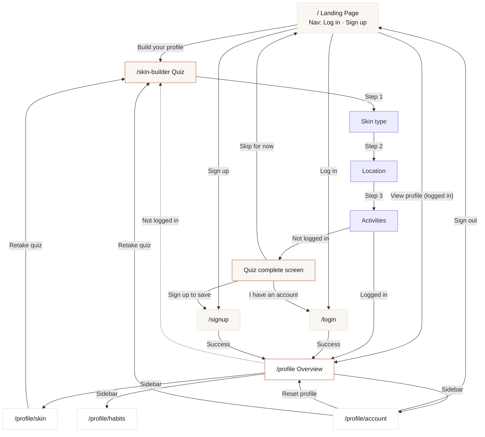
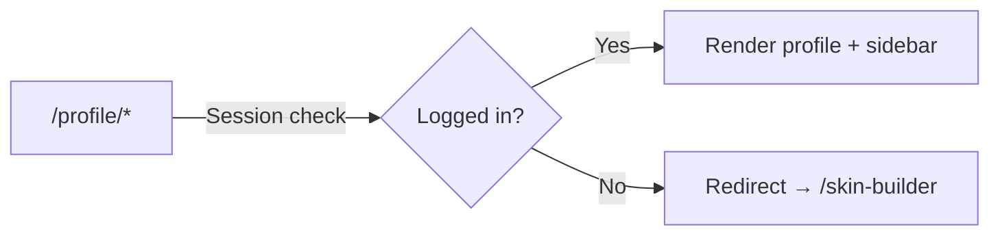

# GlowSafe — Route Map & User Journey

## User journey

From the **landing page** (`/`), users can:
- **Nav:** Log in, Sign up (or, when logged in: Profile, Sign out) via the header.
- **Hero:** “Build your profile” → quiz, or “View profile” → profile (when they have a saved profile and are logged in).
- **Check today’s UV** → early-access section.

## Auth guard

## Routes

| Route | Auth | Purpose | File |
|---|---|---|---|
| `/` | Public | Landing: hero (Build profile / View profile CTA), nav with **Log in** & **Sign up** (or Profile & Sign out when logged in), how it works, CTA, footer | `app/page.tsx` |
| `/skin-builder` | Public | 3-step quiz → saves profile to `localStorage`. If logged in, redirects to `/profile`. If not, shows sign-up prompt. | `app/skin-builder/page.tsx` |
| `/login` | Public | Email + password login. Redirects to callback URL (default `/profile`). | `app/login/page.tsx` |
| `/signup` | Public | Name + email + password registration. Redirects to callback URL (default `/profile`). | `app/signup/page.tsx` |
| `/profile` | **Login required** | Overview: profile summary card, UV risk, actions. Sidebar layout with sub-views. | `app/profile/page.tsx` |
| `/profile/skin` | **Login required** | Read-only skin profile details + "Retake quiz" CTA. | `app/profile/skin/page.tsx` |
| `/profile/habits` | **Login required** | Sun habits questionnaire: burn history, work pattern, peak sun, sunscreen, protection gear. | `app/profile/habits/page.tsx` |
| `/profile/account` | **Login required** | Account info (name, email, joined), sign out, reset profile, retake quiz. | `app/profile/account/page.tsx` |

## User flow

### New user (no account)

1. Lands on `/` — sees hero, **Log in** and **Sign up** in the nav, and “Build your profile” CTA.
2. Can sign up from the nav, or take the quiz first: `/skin-builder` — 3 steps (skin type → location → activities).
3. Quiz saves profile to `localStorage`, shows completion screen.
4. User chooses “Sign up to save” → `/signup` → creates account → lands on `/profile`.
5. Profile sidebar: Overview, Skin Profile, Sun Habits, Account.

### Returning user (has account)

1. Lands on `/` — nav shows "Profile" + "Sign out" (via `UserMenu`).
2. Clicks "Profile" or "View profile" → `/profile` (auth guard passes).
3. Can browse sidebar views, retake quiz, update habits.

### Returning user (logged out, has localStorage profile)

1. Lands on `/` — hero CTA shows "View profile" but `/profile` auth guard redirects to `/skin-builder`.
2. Can retake quiz or log in to access profile.

## Storage

| Key | Type | Purpose |
|---|---|---|
| `glowsafe_skin_profile` | JSON | `{ skinTypeId, locationId, activityIds, uvRiskLevel, burnHistory?, workPattern?, peakSunExposure?, sunscreenFrequency?, protectionHabits?[] }` |
| `glowsafe_user_email` | string | Legacy email key (pre-auth) |
| `glowsafe_sidebar` | `"true" \| "false"` | Sidebar open/collapsed state (sessionStorage) |

## Key files

| File | Role |
|---|---|
| `app/layout.tsx` | Root layout (Nunito font, global CSS) |
| `app/profile/layout.tsx` | Profile sidebar layout + auth guard |
| `lib/auth.ts` | `better-auth` server config (Drizzle + Neon PG) |
| `lib/auth-client.ts` | `better-auth` React client |
| `lib/skin-profile-data.ts` | Shared types, option constants, risk calculation, storage keys |
| `components/auth/user-menu.tsx` | Nav auth: **Log in** & **Sign up** when guest; **Profile** & **Sign out** when logged in. Used in landing header (desktop and mobile). |
| `components/landing/hero-profile-cta.tsx` | Hero CTA that switches based on localStorage profile |
| `db/schema.ts` | Drizzle schema: user, session, account, verification |
